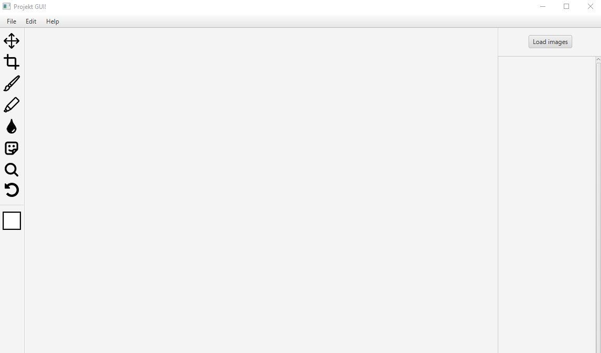
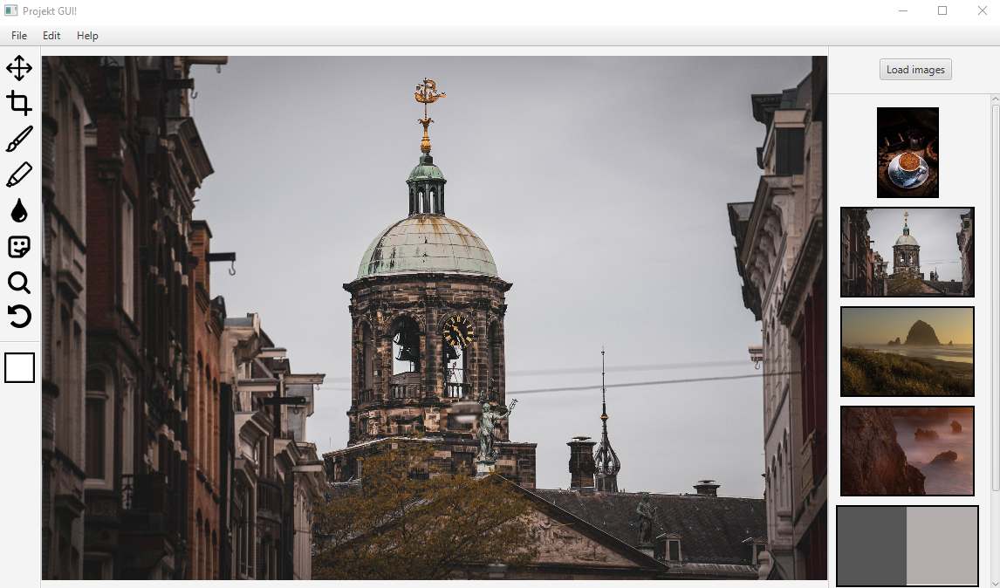
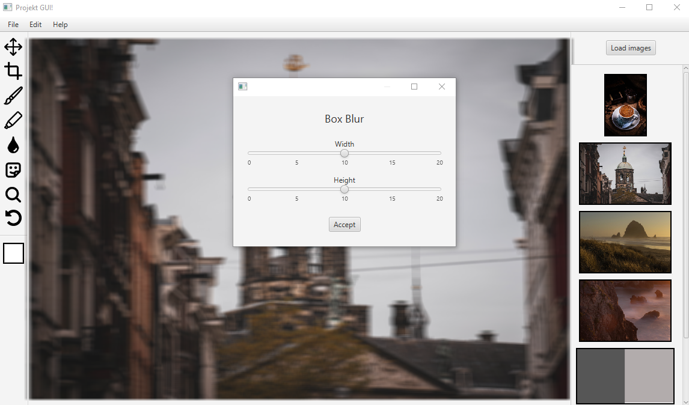
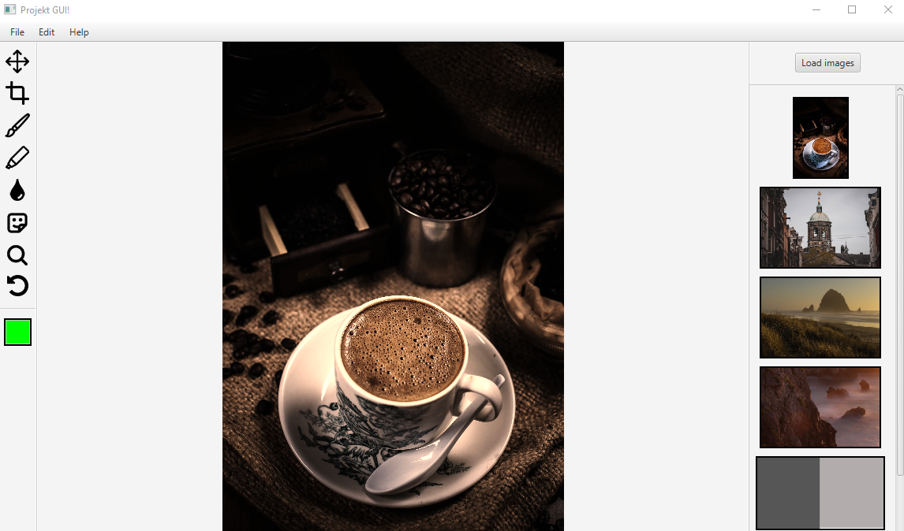

# JavaFX practice application

**Not meant to be functional, this was created for practicing design in JavaFX**

 JavaFX application for editing multiple images at once. It loads selected images and displays their previews. 
 Contains color picker, multiple windows for choosing filter parameters and saving/loading files.

## Demo

[Executable](https://drive.google.com/file/d/108GeN5FLw3typ-26MOzuYn7thvQdSXl4/view?usp=sharing) - comes bundled with Java, just extract and run.

## Screenshots

## Features

- Loading images
- Image previews, ability to change current image
- Applying basic filters
- Separate windows for choosing filter parameters
- Color picker

## Technologies

- Java
- JavaFX

## Authors

- [@dkrucze](https://github.com/TheKiromen)
